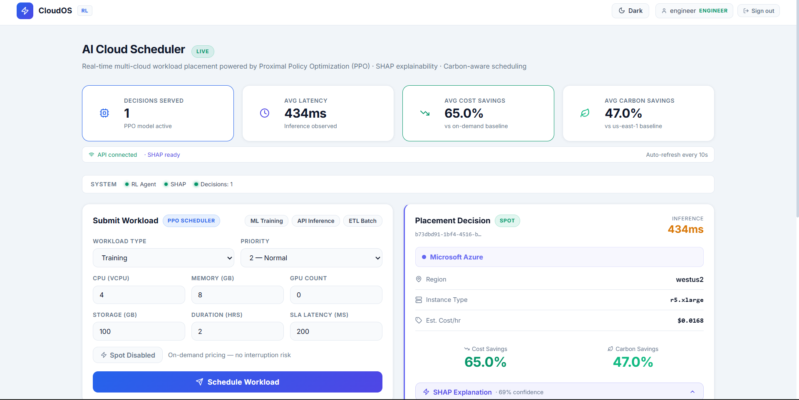
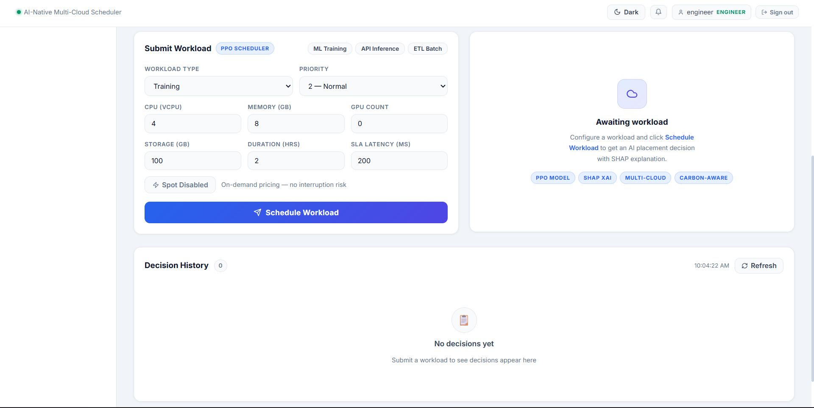
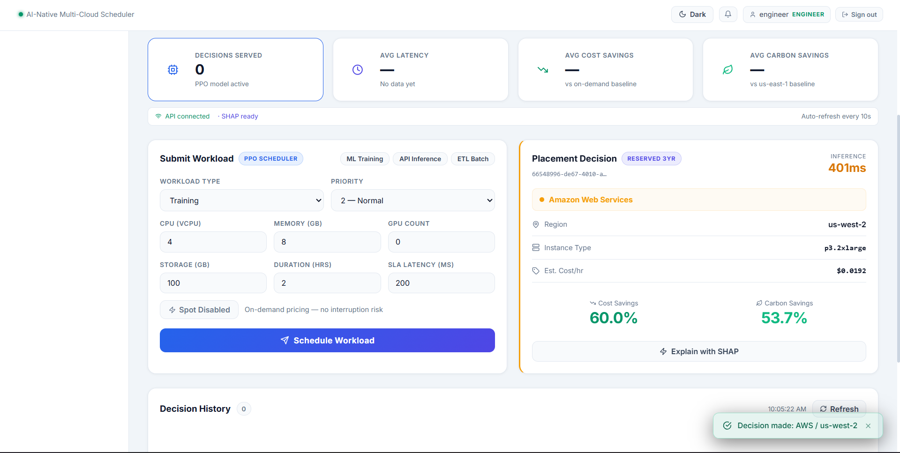
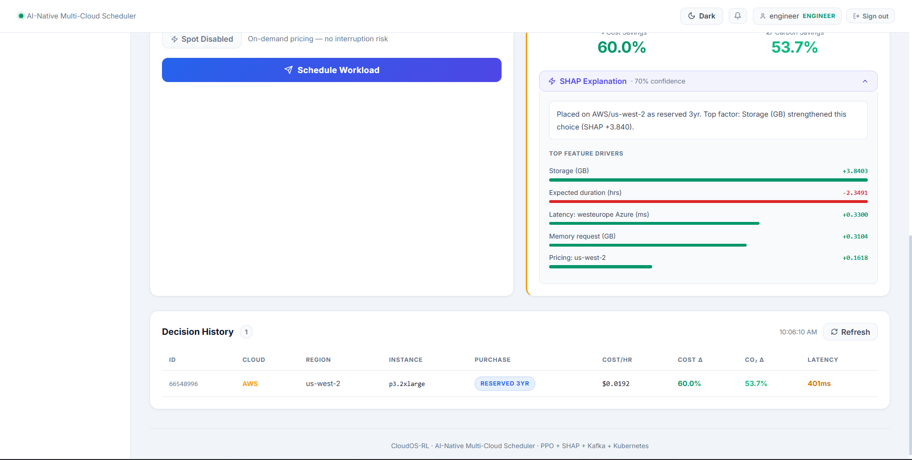

CloudOS-RL  
AI Multi-Cloud Scheduler  

AI-driven multi-cloud scheduler that optimizes cost, latency, carbon, and SLA using Reinforcement Learning with explainable decisions.

Overview  

CloudOS-RL selects the optimal cloud (AWS, Azure, GCP) for workloads by optimizing cost, latency, carbon, and SLA, designed for real-time multi-cloud scheduling.

What It Does  

Input  
A workload request with compute, memory, and latency requirements  

Output  
Optimal cloud placement with region, cost, latency, and confidence score  

Product  

Dashboard  
Main monitoring view showing scheduler status, KPIs, and workload management in a single interface.  

Scheduling  
Workload submission form used to define compute, memory, storage, latency, and placement preferences.  

Decision Output  
Placement result showing selected cloud, region, instance type, cost, latency, and savings metrics.  

Explainability  
SHAP-based explanation panel highlighting the top factors that influenced the scheduling decision.  

System Flow  

Request → FastAPI → PPO RL → Decision  
                          ↓  
                    SHAP Explain  
                          ↓  
                    Kafka → UI  

Security  

JWT authentication  
bcrypt password hashing  
Role-based access control  

Roles: viewer · user · engineer · admin · executive  

Tech Stack  

Backend: FastAPI (Python)  
AI: PPO (Stable-Baselines3)  
Explainability: SHAP  
Streaming: Kafka  
Frontend: React + Vite  
Infrastructure: Docker, Kubernetes  

API  

POST /auth/register  
POST /auth/login  
POST /api/v1/schedule  
GET /api/v1/decisions  
POST /api/v1/decisions/{id}/explain  

Run  

git clone https://github.com/KadhirDev/CloudOS-RL.git  
cd CloudOS-RL  

docker build -t cloudos-api .  
minikube start  
kubectl apply -f infrastructure/k8s/  
kubectl port-forward svc/cloudos-api-svc 8001:8000 -n cloudos-rl  

Performance  

Latency: 300–700 ms  
Stable under load  
